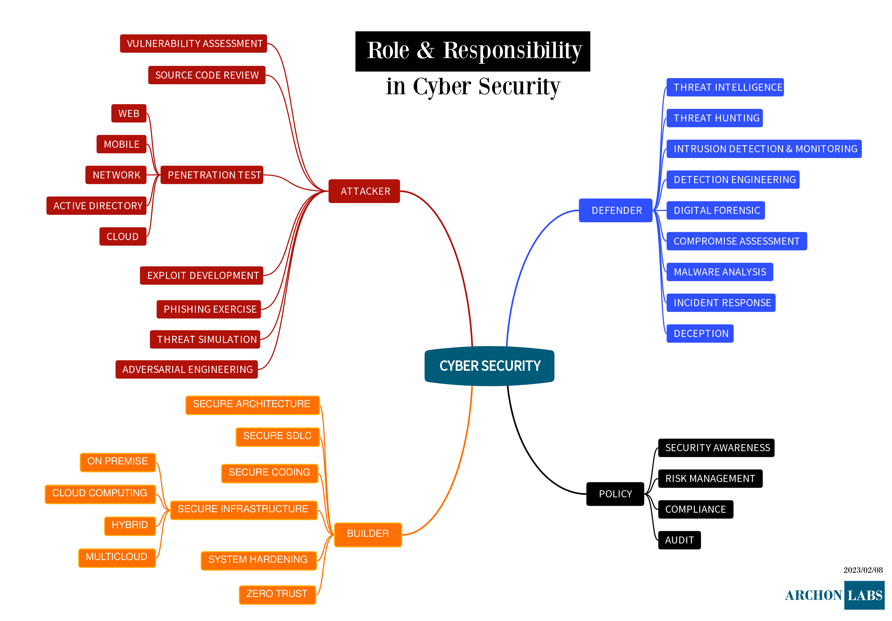

# Cyber Security Road Maps

`Cyber Security` is a collaborative effort of many people. 

This repository is used to help people exploring roles and career in cyber security. 

The career will include recommendation for:
* skills (hard and soft)
* education
* certification

## ATTACKER

* Penetration Tester
    - [Network Penetration Tester](attacker/pentester-network.md)
    - [Mobile App Penetration Tester](attacker/pentester-mobile-app.md)
    - [Web Penetration Tester](attacker/pentester-web.md)
* [Exploit Developer](attacker/exploit-developer.md)
* Adversarial Engineer

## DEFENDER

* SOC (Security Operation Center) Member
* Threat Hunter
* Detected Engineer
* Digital Forensic Investigator
* Malware Analyst
* Incident Responder

## BUILDER

* Information Security Analyst
* Source Code Auditor
* Security Engineer
* DevSecOps Engineer

## POLICY

* Data Privacy Officer
* Chief Information Security Officer
* Chief Security Officer

## Other

* SCADA Security Specialist